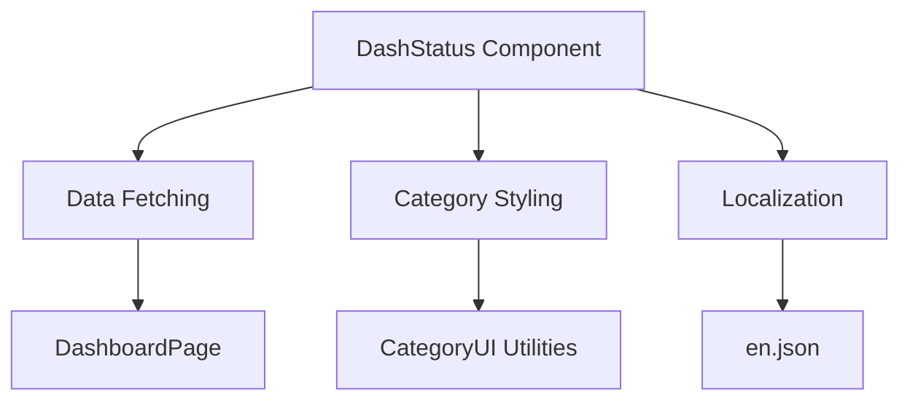

# DashStatus Component Implementation Plan

## Overview
Port the `StatusContainer` component from LOS to LOSMAX as `DashStatus`, adapting it to match LOSMAX architecture patterns.



## Implementation Steps

### 1. Create DashStatus Component
- Location: `frontend/src/components/dashboard/DashStatus.tsx`
- Key features:
  - Display task completion statistics
  - Show goals by category
  - Responsive design with Tailwind

```tsx
// Sample structure
import { getCategoryColorClass } from '@/components/ui/CategoryUI';

export default function DashStatus({ todayTasks, activeGoals }) {
  // Calculate completion percentage
  const completed = todayTasks.filter(t => t.status === 'complete').length;
  const percentage = Math.round((completed / todayTasks.length) * 100);

  return (
    <div className="dashboard-status">
      {/* Status summary */}
      <div className="completion-stats">
        <h3>{t('dashboard.today_completion')}</h3>
        <p>{percentage}%</p>
      </div>
      
      {/* Goals by category */}
      {['Family', 'Work', 'Health', 'Personal'].map(category => (
        <div key={category} className={getCategoryColorClass(category, 'text')}>
          <h4>{t(`categories.${category.toLowerCase()}`)}</h4>
          {/* Category goals list */}
        </div>
      ))}
    </div>
  )
}
```

### 2. Modify DashboardPage
- Location: `frontend/src/pages/DashboardPage.tsx`
- Add data fetching:
```tsx
useEffect(() => {
  const fetchData = async () => {
    setTodayTasks(await getTasks(undefined, 'today'));
    setActiveGoals(await getGoals('active'));
  };
  fetchData();
}, []);
```
- Integrate DashStatus:
```tsx
<DashboardLayout>
  <DashStatus todayTasks={todayTasks} activeGoals={activeGoals} />
  {/* Existing dashboard content */}
</DashboardLayout>
```

### 3. Localization Updates
- Add keys to `frontend/src/locales/en.json`:
```json
{
  "dashboard": {
    "today_completion": "Today's Completion",
    "goals_by_category": "Goals by Category"
  }
}
```

### 4. Integration Points
- Add to DashboardLayout:
```tsx
<div className="grid grid-cols-1 md:grid-cols-3 gap-6">
  <DashStatus />
  {/* Other dashboard components */}
</div>
```

## Timeline
1. Day 1: Create DashStatus component
2. Day 1: Implement data fetching in DashboardPage
3. Day 1: Add localization keys
4. Day 1: Integration and testing

## Dependencies
- Existing API services (`getTasks`, `getGoals`)
- CategoryUI utilities
- React-i18next localization