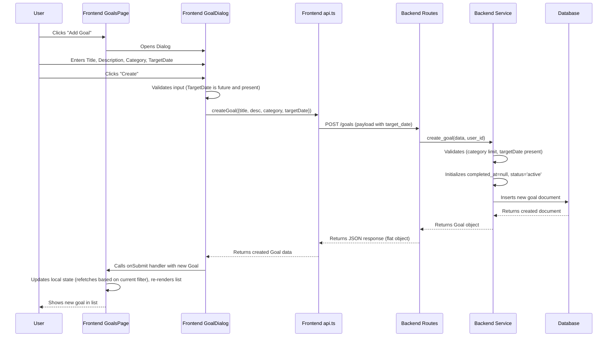

# Revised Porting Plan: `LOS` Goals to `LOSMAX` (Simplified with Status Filter)

This document outlines the plan to port core goal functionalities from the `LOS` project to the `LOSMAX` project, focusing on mandatory target dates and incorporating a status filter (Active, Completed, All) on the Goals Page. Progress tracking features are excluded for this iteration.

**Key Decisions Incorporated:**

1.  **Progress Tracking Excluded**: `progress`, `last_progress_update`, and `progress_history` features are out of scope for this port.
2.  **Target Date Mandatory**: `target_date` will be a required field for all goals.
3.  **API List Response**: API endpoints listing goals will return a flat list of goal objects.
4.  **Frontend HTTP Client**: `LOSMAX` frontend will continue to use the `fetch` API.
5.  **Goal Status Filter**: The Goals Page will include a filter for "Active" (default), "Completed", and "All" goals.

## 1. Backend Enhancements (LOSMAX - Python/FastAPI)

### 1.1. Data Model Update ([`backend/models/goal.py`](backend/models/goal.py))

*   **Modify `GoalBase` and `Goal` Pydantic models:**
    *   Change `target_date: Optional[datetime] = None` to `target_date: datetime`.
    *   Add `completed_at: Optional[datetime] = None`.
*   **Status Management:**
    *   Retain `status: GoalStatus` (enum: `active`, `completed`).
    *   The service layer will manage `completed_at`: set when `status` becomes `completed`, and clear if a goal is reactivated.

### 1.2. Service Layer Update ([`backend/services/goal_service.py`](backend/services/goal_service.py))

*   **Update `create_goal`:**
    *   Ensure `target_date` is a required parameter and handled.
    *   Initialize `completed_at = None` and `status = GoalStatus.ACTIVE`.
*   **Update `update_goal`:**
    *   Allow updates to `title`, `description`, `target_date`, `status`.
    *   If `status` changes to `completed`: set `completed_at = datetime.utcnow()`.
    *   If `status` changes from `completed` to `active`: set `completed_at = None`.
*   **Modify `get_goals_by_user(user_id: str, status_filter: Optional[GoalStatus] = None) -> list[Goal]`**:
    *   Accept an optional `status_filter` parameter.
    *   If `status_filter` is provided (e.g., `GoalStatus.ACTIVE` or `GoalStatus.COMPLETED`), the database query will filter by this status.
    *   If `status_filter` is `None`, it will return all goals for the user (both active and completed).

### 1.3. API Route Updates ([`backend/routes/goals.py`](backend/routes/goals.py))

*   **`POST /goals` ([`create_new_goal`](backend/routes/goals.py:18)):**
    *   The `GoalCreate` model in the request body must include `target_date`.
*   **`PUT /goals/{goal_id}` ([`update_existing_goal`](backend/routes/goals.py:49)):**
    *   The update payload can include `target_date` and `status`.
*   **Modify `GET /goals` ([`list_user_goals`](backend/routes/goals.py:31)):**
    *   Accept an optional query parameter: `status: Optional[GoalStatus] = Query(None)`.
    *   Pass this `status` to the `goal_service.get_goals_by_user` method's `status_filter` parameter.
    *   This endpoint will serve requests for all goals (`GET /goals`), active goals (`GET /goals?status=active`), and completed goals (`GET /goals?status=completed`).
    *   Returns a flat list of `Goal` objects.

## 2. Frontend Enhancements (LOSMAX - React/TypeScript)

### 2.1. Data Model/Type Updates (e.g., in `frontend/src/types/goals.ts` or inline)

*   Define/Update the `Goal` interface:
    ```typescript
    interface Goal {
      id: string;
      user_id: string;
      title: string;
      description?: string;
      category: string; // Consider a 'GoalCategory' string literal type
      status: 'active' | 'completed';
      target_date: string; // ISO string from API
      completed_at?: string; // ISO string from API
      created_at: string; // ISO string from API
      updated_at: string; // ISO string from API
      days_remaining?: number; // To be calculated client-side
    }
    ```

### 2.2. API Service Updates ([`frontend/src/services/api.ts`](frontend/src/services/api.ts))

*   **Modify `createGoal(goalData: { title: string; description?: string; category: string; target_date: string })`**:
    *   Ensure payload includes mandatory `target_date`.
*   **Add `updateGoal(goalId: string, goalData: Partial<Omit<Goal, 'id' | 'user_id' | 'created_at' | 'updated_at' | 'days_remaining'>>): Promise<Goal>`**:
    *   Sends `PUT` request to `/goals/${goalId}`.
*   **Add `deleteGoal(goalId: string): Promise<void>`**:
    *   Sends `DELETE` request to `/goals/${goalId}`.
*   **Modify `getGoals(status?: 'active' | 'completed'): Promise<Goal[]>`**:
    *   Accept an optional `status` argument.
    *   If `status` is provided, append `?status=${status}` to the request URL (e.g., `/goals?status=active`).
    *   If no `status` is provided, call `/goals` to retrieve all goals.
*   Handle date string conversions as needed.

### 2.3. UI Component Updates

*   **`GoalsPage.tsx` ([`frontend/src/pages/GoalsPage.tsx`](frontend/src/pages/GoalsPage.tsx)):**
    *   **Filter State**: Add state for the current filter: `const [currentFilter, setCurrentFilter] = useState<'active' | 'completed' | 'all'>('active');`.
    *   **Filter UI**: Implement UI elements (e.g., buttons, tabs, dropdown) for users to select "Active", "Completed", or "All".
    *   **Data Fetching**: On component mount and when `currentFilter` changes, call the modified `getGoals` API service function:
        *   `currentFilter === 'active'` -> `getGoals('active')`
        *   `currentFilter === 'completed'` -> `getGoals('completed')`
        *   `currentFilter === 'all'` -> `getGoals()` (no status argument)
    *   **Goal Creation Form/Modal**: Update to include a mandatory `target_date` input.
    *   **CRUD Operations**: Implement handlers for editing, deleting, and changing goal status. Ensure that after an action (e.g., completing a goal), the list is refetched or updated according to the `currentFilter`.
*   **New Component: `GoalCard.tsx`**:
    *   Displays goal details: `title`, `description`, `category`, `target_date`.
    *   Calculates and displays `days_remaining`.
    *   Shows `status`.
    *   Provides UI elements (buttons/icons) for Edit, Delete, and Mark Complete/Reopen.
*   **New/Modified Component: `GoalDialog.tsx` (for creating/editing goals):**
    *   Form fields: `title` (text), `description` (textarea), `category` (select), `target_date` (date picker - mandatory).
    *   Client-side validation for `target_date` (e.g., must be a future date).

### 2.4. State Management

*   Manage state within `GoalsPage.tsx` or relevant components.
*   Update local state after successful API calls to reflect changes, considering the active filter.
*   A custom hook (e.g., `useGoals`) can be considered later for more complex state logic.

### 2.5. Calculating `days_remaining`

*   Implement a client-side utility function:
    ```typescript
    function calculateDaysRemaining(targetDateISOString: string): number {
      const target = new Date(targetDateISOString);
      const today = new Date();
      // Ensure time part is zeroed out for fair day comparison
      today.setHours(0, 0, 0, 0);
      target.setHours(0, 0, 0, 0);
      const diffTime = target.getTime() - today.getTime();
      if (diffTime < 0) return 0; // Or handle as overdue
      return Math.ceil(diffTime / (1000 * 60 * 60 * 24));
    }
    ```

## 3. Illustrative Flow for Goal Creation (Simplified)



## 4. Actionable Tasks for Implementation

### Phase 1: Backend
1.  **Task 1.1**: Update `Goal` Pydantic models in [`backend/models/goal.py`](backend/models/goal.py) (mandatory `target_date`, add `completed_at`).
2.  **Task 1.2**: Modify `GoalService` in [`backend/services/goal_service.py`](backend/services/goal_service.py):
    *   Handle mandatory `target_date` during creation.
    *   Manage `completed_at` with `status` updates.
    *   Update `get_goals_by_user` to accept and use an optional `status_filter`.
3.  **Task 1.3**: Adjust API in [`backend/routes/goals.py`](backend/routes/goals.py):
    *   `POST /goals`: Ensure `GoalCreate` requires `target_date`.
    *   `GET /goals`: Modify to accept an optional `status` query parameter and pass it to the service.

### Phase 2: Frontend
1.  **Task 2.1**: Define the updated `Goal` TypeScript interface.
2.  **Task 2.2**: Update/Add API service functions in [`frontend/src/services/api.ts`](frontend/src/services/api.ts):
    *   `createGoal`: Require `target_date`.
    *   `getGoals`: Modify to accept optional `status` and build URL accordingly.
    *   Add `updateGoal`, `deleteGoal`.
3.  **Task 2.3**: Develop or modify `GoalDialog.tsx` for mandatory `target_date` input and validation.
4.  **Task 2.4**: Develop `GoalCard.tsx` to display goal details (including `target_date`, calculated `days_remaining`, `status`) and action buttons.
5.  **Task 2.5**: Integrate into `GoalsPage.tsx` ([`frontend/src/pages/GoalsPage.tsx`](frontend/src/pages/GoalsPage.tsx)):
    *   Add filter UI (buttons/tabs for "Active", "Completed", "All").
    *   Implement state for `currentFilter`.
    *   Update data fetching logic to use `getGoals` with the `currentFilter`.
    *   Integrate `GoalCard` and `GoalDialog`.
    *   Implement `days_remaining` calculation.