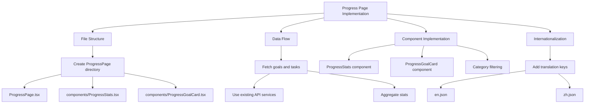

# Progress Page Implementation Plan

## Objective
Copy the progress page implementation from LOS to LOSMAX, adapting UI and functions while maintaining LOSMAX's business logic and patterns.



## Implementation Tasks

### 1. File Structure Setup
```markdown
- [ ] Create directory: `frontend/src/pages/ProgressPage/`
- [ ] Create main file: `ProgressPage.tsx`
- [ ] Create components subdirectory: `components/`
- [ ] Create component: `ProgressStats.tsx`
- [ ] Create component: `ProgressGoalCard.tsx`
```

### 2. Data Fetching Implementation
```markdown
- [ ] Implement data fetching using existing services:
  ```tsx
  import { getGoals, getTasks } from '../../services/api';
  ```
- [ ] Calculate statistics:
  - Total goals
  - Completed goals
  - In-progress goals
  - Average task completion
```

### 3. Component Implementation

#### ProgressStats.tsx
```markdown
- [ ] Create stats display grid (4 columns)
- [ ] Implement stat cards with Tailwind classes
- [ ] Add loading states
```

#### ProgressGoalCard.tsx
```markdown
- [ ] Adapt LOS progress card to use:
  ```tsx
  import { Goal, Task } from '../../types';
  ```
- [ ] Implement progress bar visualization
- [ ] Display days remaining
- [ ] Add category icon support
```

### 4. Filtering System
```markdown
- [ ] Implement category filter buttons
- [ ] Implement status filter dropdown
- [ ] Use existing CategoryHeader component:
  ```tsx
  import { CategoryHeader } from '../ui/CategoryUI';
  ```
```

### 5. Internationalization
```markdown
- [ ] Add translation keys to `en.json`:
  ```json
  "progressPage": {
    "overview": "Overview",
    "stats": {
      "totalGoals": "Total Goals",
      "completedGoals": "Completed Goals",
      "inProgressGoals": "In Progress Goals",
      "avgTaskCompletion": "Avg. Task Completion"
    },
    "analytics": {
      "title": "Goals Analytics",
      "all": "All",
      "active": "Active",
      "completed": "Completed"
    },
    "categories": {
      "family": "Family",
      "work": "Work",
      "health": "Health",
      "personal": "Personal"
    }
  }
  ```
- [ ] Add corresponding keys to `zh.json`
```

### 6. Integration
```markdown
- [ ] Add route to `MainLayoutRoutes.tsx`:
  ```tsx
  {
    path: '/progress',
    element: <ProgressPage />,
  }
  ```
- [ ] Implement consistent error handling with toast notifications
```

## Estimated Timeline
```mermaid
gantt
    title Progress Page Implementation Timeline
    dateFormat  YYYY-MM-DD
    section Components
    File Structure       :done,    des1, 2025-05-06, 1d
    Data Fetching        :active,  des2, 2025-05-07, 1d
    ProgressStats        :         des3, 2025-05-08, 1d
    ProgressGoalCard    :         des4, 2025-05-09, 2d
    Filtering System     :         des5, 2025-05-11, 1d
    section Integration
    Translation          :         des6, 2025-05-12, 1d
    Routing              :         des7, 2025-05-13, 1d
    Testing              :         des8, 2025-05-14, 2d