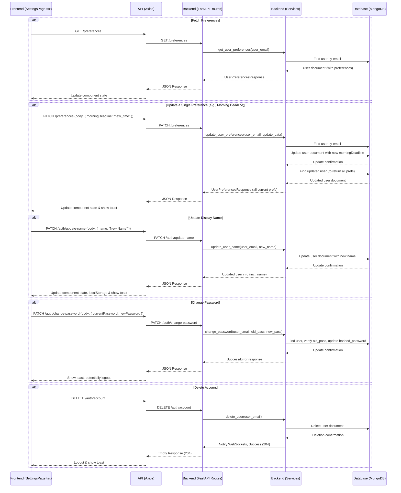

# Settings Page Implementation Plan

This document outlines the plan to implement the user settings page functionality for LOSMAX.

## Core Requirements:
- Users should be able to set and update:
    - Morning Task Deadline
    - Evening Task Deadline
    - Notification Preference (Enabled/Disabled)
    - Language Preference
    - Display Name
    - Password
- Settings for deadlines, notifications, and language should be saved individually as they are changed by the user.
- Account deletion functionality should also be available.

## Default Values for Preferences:
- Morning Deadline: "09:00"
- Evening Deadline: "22:00"
- Notifications Enabled: `false`
- Language: "en"

## Proposed Phases for Implementation:

**Phase 1: Backend - User Preferences Model & Core API Endpoints**
   1.  **Extend User Model (`backend/models/user.py`):**
       *   Add to `UserInDB`:
           *   `morning_deadline: Optional[str] = "09:00"`
           *   `evening_deadline: Optional[str] = "22:00"`
           *   `notifications_enabled: Optional[bool] = False`
           *   `language: Optional[str] = "en"`
   2.  **Create User Preferences Pydantic Models (e.g., `backend/models/preferences.py` or `user.py`):**
       *   `UserPreferencesResponse(BaseModel)`: For returning all preferences.
           *   `morning_deadline: str`
           *   `evening_deadline: str`
           *   `notifications_enabled: bool`
           *   `language: str`
       *   `UserPreferencesUpdate(BaseModel)`: For partial updates (all fields optional).
           *   `morning_deadline: Optional[str]`
           *   `evening_deadline: Optional[str]`
           *   `notifications_enabled: Optional[bool]`
           *   `language: Optional[str]`
   3.  **Implement Preferences Service Logic (e.g., `backend/services/preferences_service.py`):**
       *   `async def get_user_preferences(user_email: str) -> UserPreferencesResponse`: Fetches user, returns preferences (with defaults).
       *   `async def update_user_preferences(user_email: str, preferences_update: UserPreferencesUpdate) -> UserPreferencesResponse`: Fetches user, updates specified fields, saves, returns all current preferences.
   4.  **Create Preferences API Endpoints (e.g., `backend/routes/preferences.py`):**
       *   `GET /preferences` (Authenticated): Calls `get_user_preferences`.
       *   `PATCH /preferences` (Authenticated): Accepts `UserPreferencesUpdate`, calls `update_user_preferences`.

**Phase 2: Backend - Update/Implement Account Management Endpoints**
   1.  **Update Name Change Logic (`backend/routes/auth.py` & `backend/services/auth_service.py`):**
       *   Ensure/Create `PATCH /auth/update-name` endpoint.
       *   Service method `update_user_name(user_email: str, new_name: str)` updates the `name` in the DB.
   2.  **Update Password Change Logic (`backend/routes/auth.py` & `backend/services/auth_service.py`):**
       *   Ensure/Create `PATCH /auth/change-password` endpoint.
       *   Service method `change_password(user_email: str, old_password: str, new_password: str)` verifies old password, updates hashed password.

**Phase 3: Frontend - Connecting to New Endpoints & UI (`frontend/src/pages/SettingsPage.tsx`)**
   1.  **Fetch Preferences:**
       *   Modify `useEffect` to call `GET /preferences`.
       *   Populate component state with fetched preferences.
   2.  **Save Individual Preferences (Deadlines, Notifications, Language):**
       *   Implement/Uncomment `savePreference` function.
       *   On UI change (e.g., `TimePicker` change, `Switch` toggle, language selection), call `savePreference` with a partial update object.
       *   `savePreference` makes a `PATCH /preferences` request.
       *   Update local state on success.
   3.  **Update Name:**
       *   Connect "Update Name" button to `PATCH /auth/update-name`.
       *   Update local state and `localStorage` on success.
   4.  **Change Password:**
       *   Connect "Change Password" form to `PATCH /auth/change-password`.
   5.  **Account Deletion:**
       *   This is already mostly implemented on the frontend, calling `DELETE /auth/account`. Ensure it aligns with any backend changes from previous phases.
   6.  **UI Components (`TimePicker`, `Switch`, `ConfirmDeleteDialog`):**
       *   Initially, these will remain placeholders or basic inputs.
       *   The logic to trigger preference saves will be attached to these placeholders.
       *   Full UI component implementation can be a subsequent step.

## Data Flow Diagram (Mermaid):

## Implementation Phasing:

To make this manageable, we can implement it in the following sub-phases:

**Sub-Phase A: Backend Foundation for Preferences**
1.  **A1**: Extend `UserInDB` model with preference fields (`backend/models/user.py`).
2.  **A2**: Create `UserPreferencesResponse` and `UserPreferencesUpdate` Pydantic models.
3.  **A3**: Implement `get_user_preferences` service method.
4.  **A4**: Implement `GET /preferences` API endpoint.
5.  **A5**: *Frontend*: Update `SettingsPage.tsx` to fetch preferences from `GET /preferences` and display them (even if inputs are read-only for now).

**Sub-Phase B: Backend for Updating Individual Preferences**
1.  **B1**: Implement `update_user_preferences` service method.
2.  **B2**: Implement `PATCH /preferences` API endpoint.
3.  **B3**: *Frontend*: Implement the `savePreference` function in `SettingsPage.tsx` and connect it to the (placeholder) UI elements for morning/evening deadlines, notifications, and language selection so they call `PATCH /preferences`.

**Sub-Phase C: Backend for Name and Password Updates**
1.  **C1**: Ensure/Implement `update_user_name` service method and `PATCH /auth/update-name` endpoint.
2.  **C2**: Ensure/Implement `change_password` service method and `PATCH /auth/change-password` endpoint.
3.  **C3**: *Frontend*: Connect the "Update Name" and "Change Password" UI in `SettingsPage.tsx` to these respective endpoints.

**Sub-Phase D: Account Deletion (Review & Finalize)**
1.  **D1**: Review existing `DELETE /auth/account` endpoint and `delete_user` service method for completeness (e.g., associated data cleanup if required, though not in scope for initial pass).
2.  **D2**: *Frontend*: Ensure `SettingsPage.tsx` correctly handles the account deletion flow.

**Sub-Phase E: UI Component Implementation (Future)**
1.  **E1**: Implement or integrate proper `TimePicker`, `Switch`, and `ConfirmDeleteDialog` components in the frontend.
2.  **E2**: Replace placeholders in `SettingsPage.tsx` with these new components.

This phased approach allows for iterative development and testing.