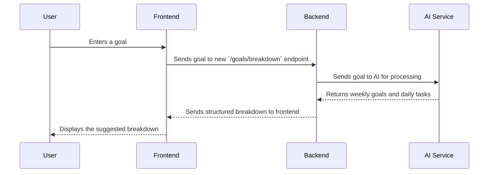

# AI-Powered Goal Breakdown Mechanism

This document outlines the design for a feature that uses AI to break down a user's goal into weekly goals and daily tasks.

## High-Level Design

The following diagram illustrates the data flow for the AI-powered goal breakdown feature.

## API Integration

A new endpoint will be created on the backend to handle the goal breakdown request:

*   **Endpoint:** `POST /goals/breakdown`
*   **Request Body:**
    *   `goal_title`: (string) The title of the goal.
    *   `goal_description`: (string) The description of the goal.
*   **Response Body:**
    *   `weekly_goals`: (array of strings) A list of suggested weekly goals.
    *   `daily_tasks`: (array of strings) A list of suggested daily tasks.

This endpoint will be responsible for calling an external AI service (e.g., OpenAI's GPT-3) to perform the goal breakdown. The backend will need to be configured with an API key for the AI service.

## User Experience

After a user creates a goal, they will be presented with an option to use AI to break it down into smaller, more manageable steps.

1.  The user clicks a "Break Down with AI" button.
2.  The frontend sends the goal's title and description to the new `/goals/breakdown` endpoint.
3.  The backend processes the request and returns a structured breakdown.
4.  The frontend displays the suggested weekly goals and daily tasks to the user.
5.  The user can then choose to accept the suggestions, which will automatically create the corresponding goals and tasks in the system.

## Backend Implementation

The backend will need to implement the following:

*   A new route for `/goals/breakdown`.
*   A new service function to handle the logic of calling the AI service.
*   Integration with an AI service client library (e.g., `openai`).
*   Error handling for cases where the AI service is unavailable or returns an error.