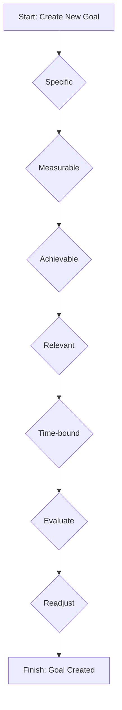

# Interactive SMARTER Goal-Setting Workflow

This document outlines the design for an interactive workflow that guides users through the process of setting goals using the SMARTER framework.

## User Flow

The following diagram illustrates the user's journey through the goal-setting process.

## UI/UX Design

The goal-setting process will be presented as a multi-step wizard within a dialog, similar to the existing `GoalDialog`. Each step will focus on one aspect of the SMARTER framework.

*   **Step 1: Specific**
    *   **Prompt:** "What exactly do you want to achieve? Be as specific as possible."
    *   **Input:** A text field for the goal's title.

*   **Step 2: Measurable**
    *   **Prompt:** "How will you measure your progress? Define clear success criteria."
    *   **Input:** A text area for the goal's description, where users can outline measurable outcomes.

*   **Step 3: Achievable**
    *   **Prompt:** "Is this goal realistic and attainable? Consider your resources and constraints."
    *   **Input:** A series of checkboxes or a slider to help the user assess the achievability of their goal.

*   **Step 4: Relevant**
    *   **Prompt:** "Why is this goal important to you? How does it align with your values?"
    *   **Input:** A dropdown to select a category (Family, Work, Health, Personal) and a text area for a personal mission statement related to the goal.

*   **Step 5: Time-bound**
    *   **Prompt:** "When do you want to achieve this goal? Set a clear deadline."
    *   **Input:** A date picker for the target date.

*   **Step 6: Evaluate**
    *   **Prompt:** "How will you evaluate your progress? Set up regular check-ins."
    *   **Input:** Options to set weekly or monthly reminders for progress evaluation.

*   **Step 7: Readjust**
    *   **Prompt:** "Are you prepared to adapt your plan if needed? Acknowledge that flexibility is key."
    *   **Input:** A checkbox to confirm understanding of the importance of readjustment.

## Backend Changes

The `Goal` model will need to be extended to store the additional information gathered during this process. New fields will be required for:

*   `evaluation_frequency`: (e.g., "weekly", "monthly")
*   `readjustment_acknowledged`: (boolean)

These changes will be reflected in the database and the API.